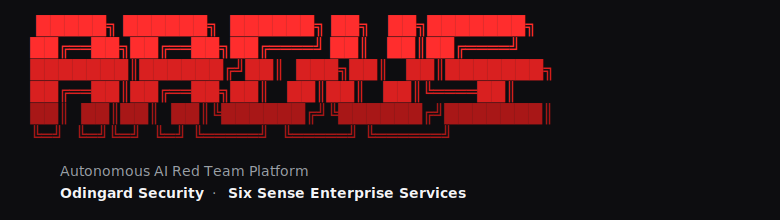

<p align="center">
  
</p>

[](https://pypi.org/project/argus-core/)
[](https://pypi.org/project/argus-core/)
[](./LICENSE-CORE)
[](https://github.com/Odingard/argus-core/actions/workflows/ci.yml)

## 1. Positioning

ARGUS does not compete with traditional pentesting tools. It does something they inherently cannot do — **test the AI-specific attack surface** that none of them were built to find. If you run SAST against your infrastructure, you still need ARGUS against the agents running on top of it. They are complementary, not competing.

## 2. Quick start

```bash
pip install argus-core
```

One input, auto-routed — the same `argus <anything>` command engages an MCP server, clones a GitHub repo, npx-launches an MCP package, runs a local script, or opens a labrat fixture:

```bash
argus mcp://customer.example/sse              # live MCP over SSE
argus github.com/vercel/mcp-handler           # clone + dispatch
argus @modelcontextprotocol/server-filesystem # npx-launched stdio MCP
argus ./my_server.py                          # local file
argus crewai://labrat                         # in-process crewAI fixture
argus --list-targets                          # every registered scheme
argus --help                                  # full operational surface
```

Engagements land in `results/`; render an offline HTML report with `argus --report results/<run>/`.

## 3. What you get in Core

ARGUS Core is the **public showcase** of the platform. Two agents ship in
Core to demonstrate the architecture end-to-end against any registered
target type. The full eleven-agent kit, the multi-agent slate runtime,
the swarm correlation layer, the management UI, and the deployment
infrastructure live in the **commercial Enterprise tier** — see section 4.

**Two offensive agents in Core:**

| Agent | Class | MAAC phase | Notes |
|---|---|---|---|
| **PI-01** | Prompt Injection Hunter | 2 | Direct, indirect, encoded, and multi-step injection variants at every chat surface the target exposes |
| **EP-11** | Environment Pivoting | 8 | Credential-discovery + code-execution chains; pivots from a foothold into ambient cloud / IMDS / process environments |

Both agents run on the same swarm contract (`SwarmAgentMixin`), so when the
swarm runtime fires they execute in parallel — the public CLI gate runs
them sequentially by default; opt into swarm with `ARGUS_SWARM_MODE=1`.

**Platform foundation (also Core):**

- **Universal LLM gateway** (`argus.shared.client`) — single Anthropic-shaped
  surface dispatches to OpenAI / Anthropic / Gemini with provider failover,
  process-wide dead-provider blacklist, and `ARGUS_LLM_CHAIN` env-var-driven
  resilience. Eight production call sites consume it; target frameworks
  inherit failover via `build_litellm_kwargs`.
- **Sandboxed engagement** — wraps untrusted MCP server subprocesses in
  `docker run` with `--cap-drop ALL`, `--network none`, `--read-only`,
  `--user 65534`, `--pids-limit 64`. Use with `argus -s <target>`.
- **One-input dispatch** — `argus <anything>` auto-routes MCP URLs,
  GitHub repos, npm/PyPI packages, local scripts, framework labrat
  fixtures, and engagement directories to the right factory.
- **Stateful runtime harness** — deterministic multi-turn replay,
  scenario library, runtime invariants.
- **Forensic Wilson bundles** — signed, reproducible evidence bundles
  suitable for VDP submission.
- **Smart corpus mutation** — offline corpus mutators with optional
  live-LLM mutators behind `ARGUS_OFFLINE=0`.
- **Workflow integrations** — GitHub Action, pre-commit hook,
  FastAPI webhook receiver (optional `webhook` extra).

## 4. Core vs. Enterprise

ARGUS is open-core. **Core (this package, MIT)** is the public CLI:
two-agent showcase, universal target dispatch, sandboxed runtime,
LLM gateway, harness primitives. Self-sufficient for operators
running their own focused engagements.

**Enterprise** is the full commercial product — eleven-agent kit
(adds `TP-02 MP-03 IS-04 CW-05 XE-06 PE-07 RC-08 SC-09 ME-10` to
the two Core agents), full slate-execution runtime, swarm
correlation layer, three-judge consensus gate, MCTS chain
synthesis, web dashboard, FastAPI execution engine, deployment
infrastructure, and managed engagement delivery.

Enterprise is **not currently sold as software**. ARGUS Enterprise
operates today as a red-team engagement service — OdinGard runs the
full eleven-agent kit against customer environments and delivers
findings reports. Customer-installable Enterprise is on the
roadmap; the engagement service is available now.

## 5. Migrating from `argus-redteam`

`argus-redteam==0.4.1` is a deprecation shim that pulls
`argus-core` as a dependency, so existing `pip install argus-redteam`
commands and `requirements.txt` pins continue to work with no code
change. Update at your convenience:

```diff
- pip install argus-redteam
+ pip install argus-core
```

The Python import name (`import argus`) did not change; source code
works identically under either install name.

## 6. Docs

- [`docs/GETTING_STARTED.md`](docs/GETTING_STARTED.md) — operator guide
- [`docs/ADDING_A_LABRAT.md`](docs/ADDING_A_LABRAT.md) — extend ARGUS to a new framework
- [`docs/NO_CHEATING.md`](docs/NO_CHEATING.md) — the integrity contract every finding must honour
- [`docs/llm-subsystem.md`](docs/llm-subsystem.md) — internal note on the universal LLM gateway
- [`PHASES.md`](PHASES.md) — full build plan + moat map
- [`SECURITY.md`](SECURITY.md) — responsible disclosure

## 7. Engagement service

If you want the full eleven-agent kit run against your AI deployment
by the team that built ARGUS:

👉 **[sixsenseenterprise.com](https://sixsenseenterprise.com)**

## 8. License

Core is MIT — see [`LICENSE-CORE`](./LICENSE-CORE). The Enterprise tier
under [`LICENSE-PRO`](./LICENSE-PRO) (placeholder today; formal
source-available terms to follow before any Enterprise tier is offered
as installable software) does not ship in this package.

Responsible-disclosure contact: `security@sixsenseenterprise.com`.
